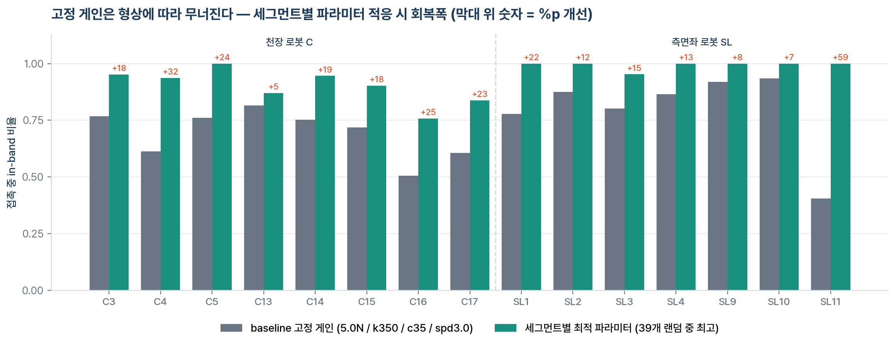
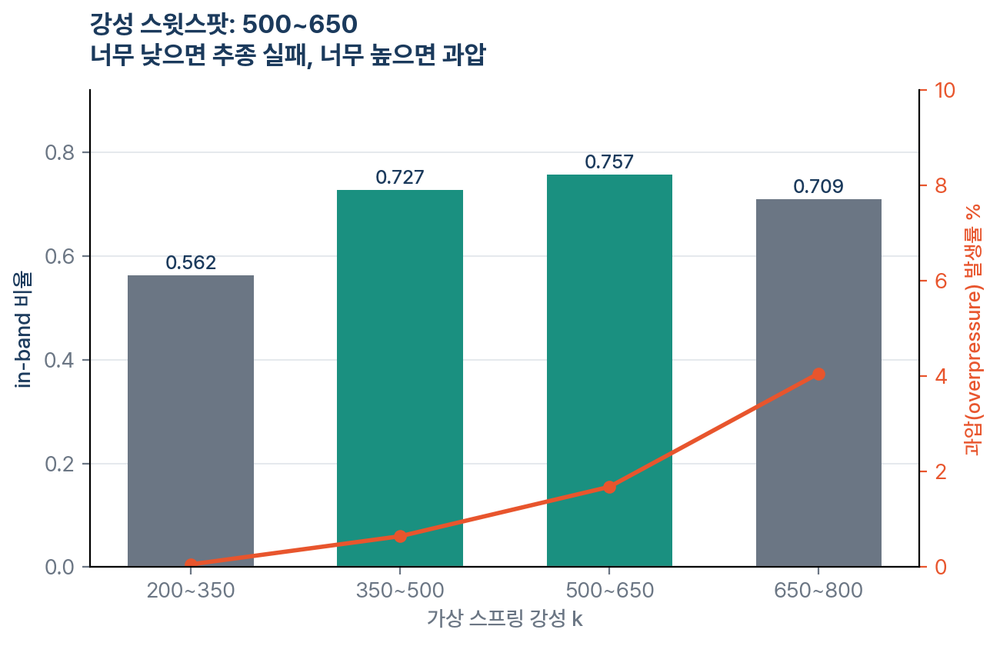
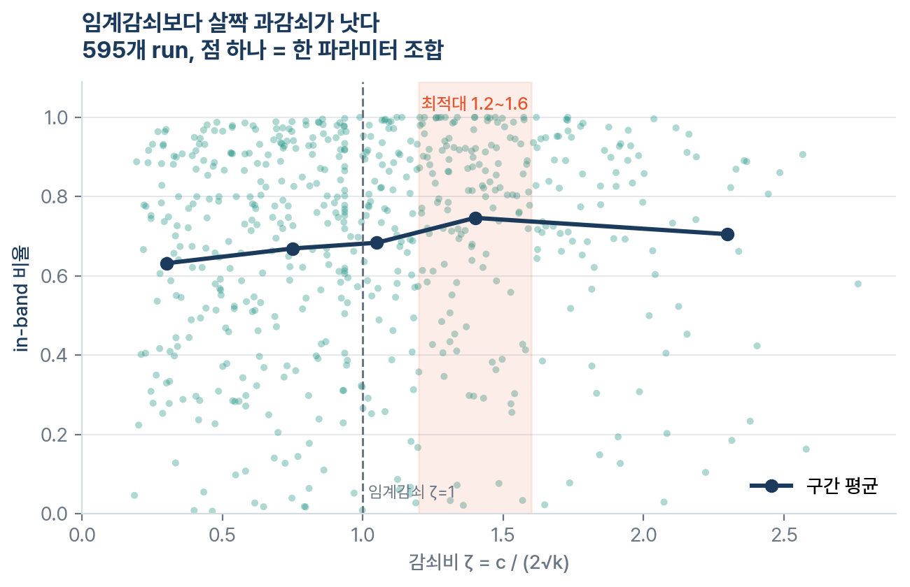
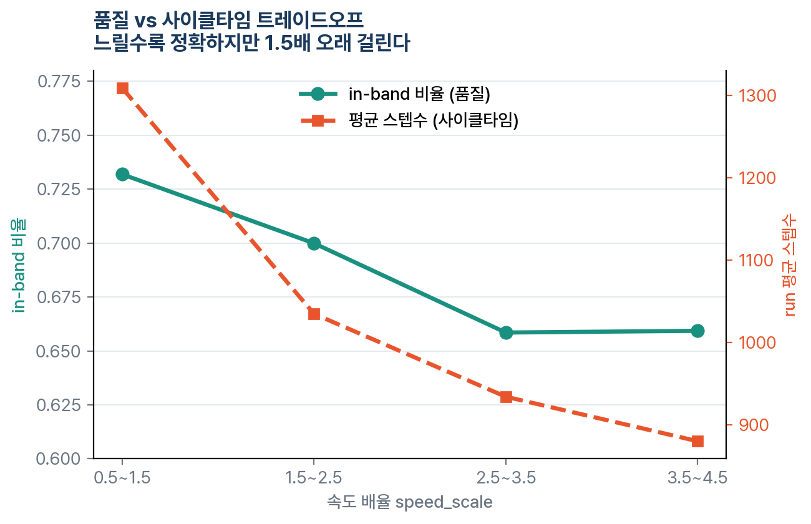
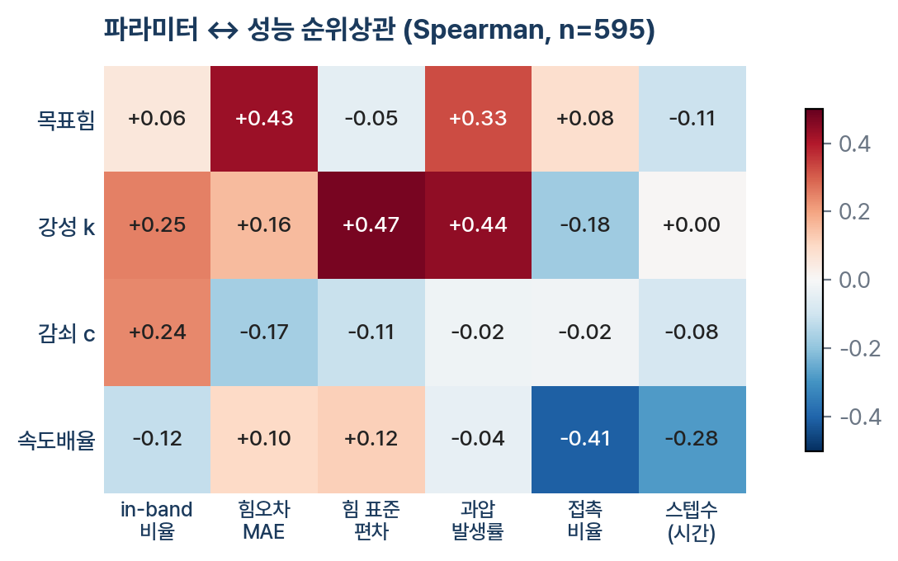

# 파라미터 스윕 데이터셋 분석 리포트

**대상**: `데이터셋/sweep_traj_csv/` (Isaac Sim 파라미터 스윕 로그)
**작성**: 2026-08-27 · CACADACA
**결론 한 줄**: 지금의 고정 게인(5.0N / k350 / c35 / spd3.0)은 차체 형상에 따라 성능이 **0.41~0.93으로 요동**치며, 세그먼트마다 파라미터를 바꿔주면 **0.76~1.00으로 회복**된다. 형상 적응형 파라미터가 필요하다는 것을 이 데이터가 정량적으로 보여준다.

---

## 1. 데이터셋 명세

| 항목 | 값 |
|---|---|
| 파일 | CSV 15개 (184MB) |
| 총 레코드 | 617,085 스텝 |
| run 수 | **595개** (세그먼트당 baseline 1 + rand 39, 일부 37~39) |
| 경로 세그먼트 | 천장 로봇 C 8개(C3·C4·C5·C13~C17) + 측면좌 로봇 SL 7개(SL1~SL4·SL9~SL11) |
| 패스 | run당 polish_pass 0/1/2 (3패스) |
| waypoint 단위 샘플 | 44,319개 (run × pass × waypoint) |
| 반복 | `_r0` 하나뿐 — **재현 반복 없음** |

### 컬럼 36개의 구조

| 묶음 | 컬럼 | 역할 |
|---|---|---|
| 식별 | `run_id`, `polish_pass`, `step`, `waypoint_idx`, `path_idx_float` | 인덱스 |
| 제어 상태(결과) | `filtered_force_n`, `target_force_n`, `virtual_force_n`, `z_offset`, `cmd_clearance`, `actual_gap`, `actual_clearance`, `pad_compression`, `contacting`, `in_band`, `overpressure`, `stable_contact_steps`, `high_force_pause_steps`, `soft_force_limit_n`, `band_lo_n`, `band_hi_n` | 가상스프링 힘제어의 실행 결과 |
| **waypoint 형상** | `wp_kappa_max`, `wp_kappa_min`(곡률), `wp_tilt_deg`(기울기), `wp_rho_edge`(가장자리 근접), `wp_dtheta_n`(법선 변화량) | **차체 형상 특징 — 이 데이터셋의 핵심 자산** |
| 파라미터(입력) | `p_*` 10개 | 제어 게인 |

### 실제로 스윕된 것 / 고정된 것

**랜덤화 4개**

| 파라미터 | 범위 | baseline |
|---|---|---|
| `p_target_force` | 2.50 ~ 9.00 N | 5.0 |
| `p_stiffness` | 200 ~ 800 | 350 |
| `p_damping` | 10 ~ 80 | 35 |
| `p_speed_scale` | 0.50 ~ 4.50 | 3.0 |

**전 run 고정 6개** — 이 데이터로는 영향을 알 수 없음
`p_press_vel` 0.025 · `p_adm_damping` 50 · `p_adm_mass` 1 · `p_lag_gain` 0.12 · `p_force_alpha` 0.55 · `p_creep_advance` 0.01333

> 랜덤 샘플값은 세그먼트마다 새로 뽑혔다(공유 LHS 아님). 따라서 595개가 모두 서로 다른 파라미터점이며, 4차원 공간 커버리지는 양호하다.

---

## 2. 분석 방법

주 성능지표는 **접촉 중 in-band 비율** = (contacting=1 인 스텝 중 in_band=1 의 비율).
접촉하지 않는 접근 구간을 분모에서 빼야 제어 품질만 볼 수 있기 때문이다. 보조지표로 힘오차 MAE(|측정힘 − 목표힘|), 힘 표준편차, 과압 발생률, run 스텝수(사이클타임 대용)를 함께 봤다.

---

## 3. 결과

### 3-1. 고정 게인은 형상에 따라 무너진다 — 핵심 발견

baseline 평균 in-band는 0.741이지만 세그먼트별 편차가 크다.

- **최악**: SL11 0.405, C16 0.505, C17 0.606
- **최선**: SL10 0.934, SL9 0.919, SL2 0.876

같은 39개 랜덤 후보 중 그 세그먼트에서 가장 좋았던 파라미터를 쓰면 전부 **0.758~1.000**으로 올라간다. SL11은 0.405 → 1.000 (+59%p), C4는 0.613 → 0.936 (+32%p).

> 이것이 "형상에 맞춰 파라미터를 바꾸는 학습 제어가 필요하다"는 주장의 정량 근거다. 지금까지는 정성적 서술뿐이었다.

### 3-2. 강성 k의 스윗스팟은 500~650

| k 구간 | in-band | 과압 발생률 |
|---|---|---|
| 200~350 | 0.562 | 0.1% |
| 350~500 | 0.727 | 0.6% |
| **500~650** | **0.757** | 1.7% |
| 650~800 | 0.709 | 4.1% |

너무 낮으면 표면을 못 따라가고(추종 실패), 너무 높으면 과압이 급증한다. 현재 baseline k=350은 스윗스팟보다 **낮은 쪽**에 있다.

### 3-3. 임계감쇠(ζ=1)보다 살짝 과감쇠가 낫다

무차원 감쇠비 ζ = c / (2√k) (m=1) 기준:

| ζ 구간 | in-band | 힘오차 MAE | 힘 표준편차 |
|---|---|---|---|
| ~0.6 | 0.632 | 2.71 | 2.00 |
| 0.6~0.9 | 0.669 | 2.45 | 1.67 |
| 0.9~1.2 | 0.684 | 2.30 | 1.68 |
| **1.2~1.6** | **0.747** | 2.09 | 1.52 |
| 1.6~ | 0.705 | 1.86 | 1.04 |

기존 문서(`CLAUDE.md`, `폴리싱_통통튀는_원리.md`)는 "임계감쇠 ζ≈1로 튐 방지"를 기준으로 삼았는데, 실제 스윕에서는 **ζ 1.2~1.6이 최적**이다. 튐 억제만 보면 ζ가 클수록 좋고(표준편차 단조 감소), in-band는 1.6을 넘으면 반응이 느려져 다시 떨어진다. baseline은 ζ = 35/(2√350) = **0.94** — 최적대보다 낮다.

### 3-4. 속도는 품질 vs 사이클타임 트레이드오프

| speed_scale | in-band | 접촉비율 | 평균 스텝수 |
|---|---|---|---|
| 0.5~1.5 | 0.732 | 0.428 | 1,308 |
| 1.5~2.5 | 0.700 | 0.361 | 1,035 |
| 2.5~3.5 | 0.659 | 0.326 | 934 |
| 3.5~4.5 | 0.659 | 0.287 | 880 |

느리면 품질이 좋아지지만 1.5배 오래 걸린다. 다만 **2.5 이상에서는 품질이 더 나빠지지 않고 평평**해지므로, 사이클타임이 중요한 구간은 3.0 근처를 유지해도 손해가 적다.

### 3-5. 파라미터 ↔ 성능 상관 지도

- `목표힘 ↑` → 힘오차 MAE ↑ (ρ=+0.43), 과압 ↑ (+0.33). **힘을 세게 걸수록 추종이 나빠진다.**
- `강성 ↑` → in-band ↑ (+0.25)이지만 힘 표준편차 ↑ (+0.47), 과압 ↑ (+0.44). 양날의 검.
- `감쇠 ↑` → in-band ↑ (+0.24), 힘오차 ↓ (−0.17). **부작용 없이 좋은 유일한 방향.**
- `속도 ↑` → 접촉비율 ↓ (−0.41), 스텝수 ↓ (−0.28).

---

## 4. 세그먼트별 권고 파라미터

`세그먼트별_최적파라미터.csv` 에 동일 내용 저장.

| 세그먼트 | baseline | 최적 | Δ | 목표힘 N | k | c | speed |
|---|---|---|---|---|---|---|---|
| C3 | 0.769 | 0.952 | +0.184 | 7.51 | 465 | 73.0 | 0.93 |
| C4 | 0.613 | 0.936 | +0.323 | 4.48 | 430 | 66.7 | 0.52 |
| C5 | 0.761 | 1.000 | +0.239 | 3.29 | 748 | 65.8 | 1.28 |
| C13 | 0.816 | 0.869 | +0.053 | 4.32 | 275 | 77.3 | 2.35 |
| C14 | 0.753 | 0.946 | +0.193 | 5.64 | 544 | 76.2 | 0.91 |
| C15 | 0.719 | 0.903 | +0.184 | 8.22 | 626 | 50.1 | 0.61 |
| C16 | 0.505 | 0.758 | +0.253 | 4.26 | 385 | 61.1 | 1.86 |
| C17 | 0.606 | 0.837 | +0.231 | 6.01 | 669 | 75.2 | 1.65 |
| SL1 | 0.778 | 1.000 | +0.222 | 4.72 | 489 | 76.5 | 1.75 |
| SL2 | 0.876 | 1.000 | +0.124 | 4.46 | 694 | 59.1 | 4.29 |
| SL3 | 0.802 | 0.952 | +0.150 | 4.18 | 419 | 69.5 | 4.09 |
| SL4 | 0.865 | 1.000 | +0.135 | 5.21 | 763 | 54.7 | 3.49 |
| SL9 | 0.919 | 1.000 | +0.081 | 3.59 | 666 | 63.0 | 4.41 |
| SL10 | 0.934 | 1.000 | +0.066 | 3.98 | 570 | 63.8 | 3.94 |
| SL11 | 0.405 | 1.000 | +0.595 | 3.86 | 582 | 67.5 | 1.39 |

**공통 경향** (중앙값): 목표힘 4.5N · k 570 · c 66 · speed 1.8 → ζ ≈ 1.38.
현재 baseline (5.0 / 350 / 35 / 3.0, ζ=0.94) 대비 **k를 올리고 c를 크게 올리는 방향**이 전반적으로 맞다.

> ⚠️ 이 표는 "39개 랜덤 후보 중 1등"이지 진짜 최적값이 아니다. 재현 반복이 없어 우연히 좋았을 가능성을 배제하지 못한다. 코드에 넣기 전 §5의 검증 스윕을 권한다.

---

## 5. 한계와 다음 스윕 설계

| 한계 | 영향 | 대응 |
|---|---|---|
| **재현 반복 없음** (`_r0`만) | 시뮬 노이즈와 파라미터 효과를 분리 못 함 | 세그먼트별 상위 3개 파라미터를 각 3회 재실행 (15×3×3 = 135 run) |
| **6개 파라미터 고정** | press_vel·lag_gain·force_alpha 등의 영향 미지 | 다음 스윕에 `p_lag_gain`, `p_force_alpha` 추가 (RMPFlow 추종지연 관련) |
| **SR·레일 세그먼트 없음** | v5 다중로봇 전체를 대표 못 함 | SR 도달한계 문제(POLISHING_PROGRESS.md)와 함께 별도 수집 |
| **목표힘 2.5~9N** | 현장 숙련공 접촉력 20~39N과 큰 격차 | 스윕 범위를 15~40N까지 확장할지 팀 결정 필요 |
| **waypoint 형상↔성능 단변량 상관 약함** (\|ρ\|<0.08) | 단순 회귀로는 예측 불가 | 다변량·비선형 모델(GBM/GP) 필요 |

### 다음 스윕 권고 설계

1. 랜덤 → **LHS(라틴 하이퍼큐브)**로 교체, 세그먼트 간 동일 샘플 공유 → 세그먼트 효과와 파라미터 효과를 분리 가능
2. 범위 축소: k 400~700, c 55~85 (이번 결과로 나쁜 영역이 확인됨)
3. 각 조건 3회 반복
4. 형상 특징 로깅 확장: 법선벡터 원본, 이웃 waypoint 곡률 변화율

---

## 6. 활용 로드맵

| 단계 | 내용 | 필요한 것 |
|---|---|---|
| **즉시** | §4 표를 코드에 세그먼트별 게인 dict로 적용 | 없음 |
| **단기** | 대리모델(surrogate) 학습 → 베이지안 최적화로 파라미터 탐색 | 595점, sklearn |
| **중기** | **L1 지도학습**: 입력=waypoint 형상 5 + 조건, 출력=최적 파라미터 4. 44,319 샘플이 이미 라벨링된 상태 | 검증 스윕 완료 후 |
| **장기** | L2 잔차 RL의 오프라인 사전학습 데이터로 재사용 | L1 완료 후 |

---

*분석 스크립트·figure 생성 코드는 요청 시 재현 가능. 원본 데이터 무손상.*
